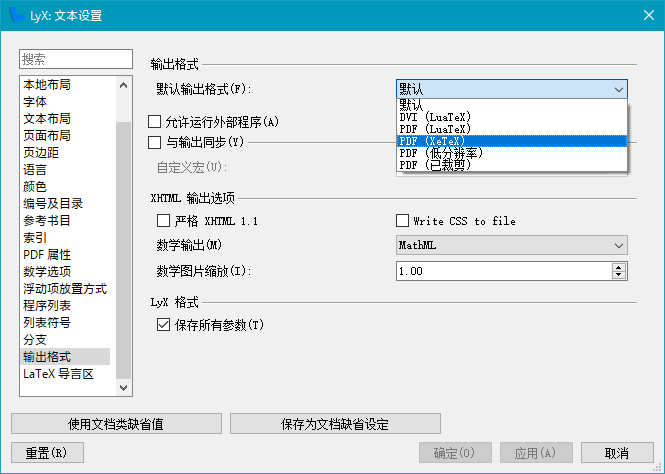

# LyTex-Portable

原作地址：[Google Code](https://code.google.com/archive/p/lytex/) 

原作发布在：[LyTeX绿色套装](http://bbs.ctex.org/forum.php?mod=viewthread&tid=46857)

原作者很久很久都没有更新了，我当年（2015）写研究生毕业论文就用的这个，相对于其他的LaTeX安装方法，这个够简单实用的，推荐入门的同学使用。

我做的改动：更新[LyX](https://mirrors.tuna.tsinghua.edu.cn/lyx/bin/)至2.3.6.1，[MikTex](https://mirrors.tuna.tsinghua.edu.cn/ctan/systems/win32/miktex/setup/)至20.6.29，[TeXWorks](https://github.com/TeXworks/texworks/releases)至0.6.5，[TinyTex](https://github.com/yihui/tinytex-releases)下载2021.02版


简单测试了一下，没发现什么问题，欢迎测试反馈！

[Release打包在度盘](https://pan.baidu.com/s/1c37Tgf2)


### 生成查看PDF


分享记录一个LaTeX的学习网站：[LaTeX Studio](http://wenda.latexstudio.net/)

##### 补充两条有参考价值的LyX中文笔记：

[在 LyX 中使用中文 - Yihui Xie | 谢益辉](https://yihui.name/cn/2011/05/write-chinese-in-lyx/)

[LaTeX中文排版（使用XeTeX）](http://linux-wiki.cn/wiki/zh-hans/LaTeX中文排版（使用XeTeX）)

#### 更新备忘

**MiKTeX更新**
[MiKTeX清华源](https://mirrors.tuna.tsinghua.edu.cn/CTAN/systems/win32/miktex/setup/windows-x86/)，下载`basic-miktex-*.exe`,**重命名**为`miktex-portable.exe` 

> 这里的重命名步骤必不可少，[参考](https://miktex.org/howto/portable-edition)

运行lytex.bat ... 
提示`Extract failed! Manually operate，then press any key to continue...`
7Zip无法解压`miktex-portable.exe`，需要手动操作，直接运行释放到`source\LyTeX\MiKTeX`下，将`texmfs`下除了`install`目录外其它的删掉，把`install`下的所有放上级目录`texmfs`中，删除`install`目录, `then press any key to continue...`

**TinyTeX更新**

折腾了三天把[TinyTeX](https://github.com/yihui/tinytex)的版本打包好了, 三天都在跳坑

原作者脚本中有一条删除`TexLive\texmf-var\web2c`, 我不明白, 就照着删, 结果坑了三天...

最终回到原点...

为了统一使用习惯, 在TinyTeX的基础上, 添加了几个包`texworks ctex CJK xeCJK xetex3`

打包后的大小比MiKTeX的版本小了近80M(应该是包少的缘故), 编译速度上也更快些, 不知是不是错觉

不像MiKTeX的GUI界面，Windows系统下TinyTeX没有GUI支持，只能用`tlmgr`在命令行界面下更新，命令也简单，常用的如下：

```bash
#设置清华源
tlmgr option repository https://mirrors.tuna.tsinghua.edu.cn/CTAN/systems/texlive/tlnet
#查看需要更新的包列表
tlmgr update --list
#全部更新
tlmgr update --all
#查看包信息
tlmgr info pacName
#安装包
tlmgr install pacNameS
```

更多命令参见[官方文档](https://tug.org/texlive/doc/tlmgr.html)

**LyX更新**
[LyX清华源](https://mirrors.tuna.tsinghua.edu.cn/lyx/bin/)下载最新版放入目录`LyTeX\Common\download`下,再用`Setup.exe`的选项更新即可。如下图所示:


### 补充一些使用注意事项

初次运行`LyX!.exe`会提示缺少包, 如下图所示:


取消每次都提醒的勾选, 然后`Install`, 然后就是长长的等待... 只有第一次需要费点时间, 以后就不会了(仅限MiKTex, [TinyTeX还没找到自动补包](https://tex.stackexchange.com/questions/110501/auto-package-download-for-texlive)的方法)

中文支持首选`XeTeX`, 在`LyX`中使用需要做如下的文档配置:




还有PDF中的链接格式也顺便改成习惯的:


有些文档`XeTeX`出错, 这是可以用`pdflatex`作为替补, 把文档的编码换一下即可:


**备忘**

Xetex编译错误：`Missing glyphs! Missing character: There is no * in font *`

字体中缺少部分字符所致，修正方法：在文档导言处插入`\setmainfont{Times New Roman}`
